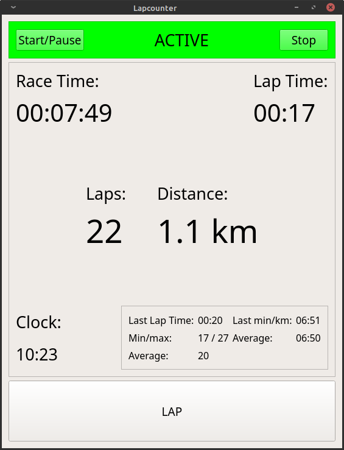

Lapcounter
==========
Counts laps for running marathons in your back yard
-----------

```
If I only knew the answer
If I change my way of living
And if I pave my streets with good times
Will the mountain keep on giving?
And if all of our days are numbered
Then why do I keep counting?
-- The Killers - Why Do I Keep Counting
```

Lapcounter was born out of a need to keep track of laps and distance
for running long distances in my back yard during the Coronavirus
pandemic.



Lapcounter provides a big lap count and distance display, as well as
additional useful info. The lap counter is incremented by pressing the
Lap button, or simply pressing space bar. Currently the lap length is
fixed to 50m, but this is easily changable in the code.

Features:
---------
* Big lap count and distance display
* Increment lap counter with space bar
* Pause/resume race
* Lap times are logged to a CSV file

Requirements:
-------------
* Windows or Linux (and probably Mac too)
* Qt 5

Building:
---------

Open the lapcounter.pro file with QtCreator and build, or run the following from the command line:
```
qmake lapcounter.pro
make
```
-----


If you like this and find it useful,

<a href="https://www.buymeacoffee.com/noedigcode" target="_blank"></a>

